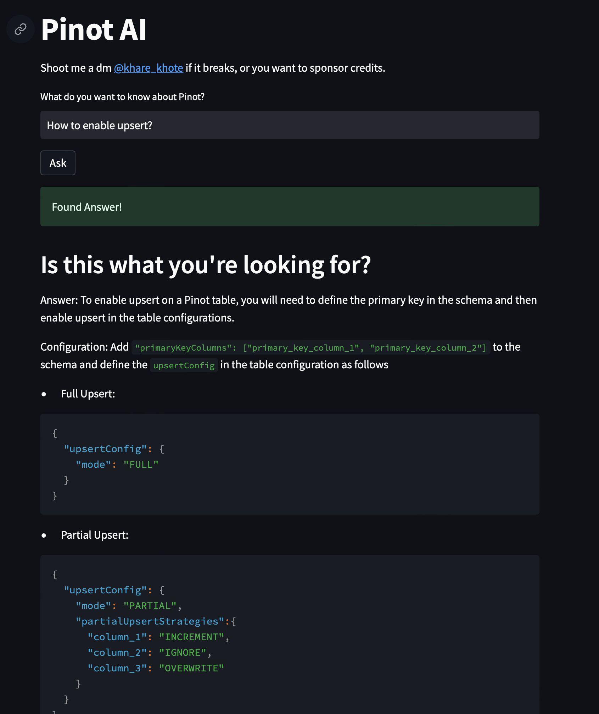

# Pinot-AI-Slack-bot

## Introduction

PinotAIBot is a Python-based chatbot that uses the Natural Language Toolkit (NLTK) library and OpenAI API to answer common queries related to Apache Pinot, a distributed columnar storage system for real-time analytics. The chatbot takes a user's question and generates a response using machine learning techniques. The responses are based on the analysis of relevant documentation available on GitHub, providing users with precise and accurate answers.

## Requirements

* Python 3.9+
* NLTK (Natural Language Toolkit) corpus - You can download it using [nltk.downloader](https://www.nltk.org/data.html)


## Environment Variables

Before running the program, you need to add the following environment variables:

* `GITHUB_API_KEY`: Your personal access token to access the GitHub API. You can generate a new token by following the instructions [here](https://docs.github.com/en/authentication/keeping-your-account-and-data-secure/creating-a-personal-access-token).
* `OPEN_AI_KEY`: Your API key for OpenAI. You can generate a new key by signing up [here](https://beta.openai.com/signup/).
* `SLACK_WEBHOOK_URL` (Optional): The URL of your Slack webhook. You can create a new webhook by following the instructions [here](https://api.slack.com/messaging/webhooks).
* `SNS_TOPIC_NAME` (Optional): The name of the SNS topic to use for sending notifications (only required when deploying on AWS Lambda).
* `SNS_TOPIC_REGION` (Optional): The region of the SNS topic to use for sending notifications (only required when deploying on AWS Lambda).

To add these environment variables, you can either set them in your system's environment variables or create a .env file in the root directory of the project.

If you want to use the docker image, add the previous env variables in a `.env` file in the root directory besides `app.py`.

## Usage Without Slack

You can use the Dockerfile present in rootdir to run the app.

Run the following commands and then headover to (http://localhost:8501)
```bash
docker build -t pinot-ai-chat .
docker run --entrypoint streamlit -p 8501:8501 pinot-ai-chat run ui.py 
```

## Examples



